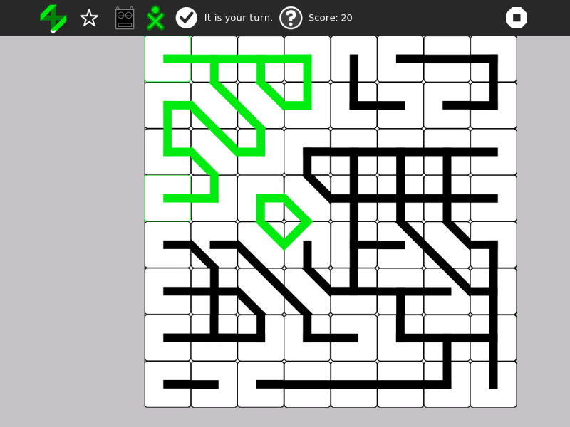

Paths Activity 
===============

Paths is a sliding tile game where the goal is to create closed paths. 64 tiles are to be arranged onto the 8×8 grid, positioning the tiles so that paths are created. Paths activity can be integrated into classroom assignments. It helps develop logical thinking.

How to use?
===============
Paths is not a part of Sugar Desktop but can be added. Refer to the following links-

* [How to Get Sugar on sugarlabs.org](https://sugarlabs.org/), 
* [How to use Sugar](https://help.sugarlabs.org/), and;
* [How to use Paths](https://wiki.sugarlabs.org/go/Activities/Paths) 

Start by dragging a tile onto the grid. Drag more tiles onto grid squares that are highlighted such that the paths are connected across the tiles. Whenever you close a path, it is highlighted in your 'XO' colors and it evaluates your score. Keep going until no move is left. You can play with buddies, too! When playing with more than one player, you'll be prompted when it is your turn.

How to upgrade?
===============
On Sugar Desktop systems;

* [Use My Settings,](https://help.sugarlabs.org/my_settings.html) [Software Update](https://help.sugarlabs.org/my_settings.html#software-update) 
* [Use Browse to open ](https://activities.sugarlabs.org/)activities.sugarlabs.org Search for Paths, then download

